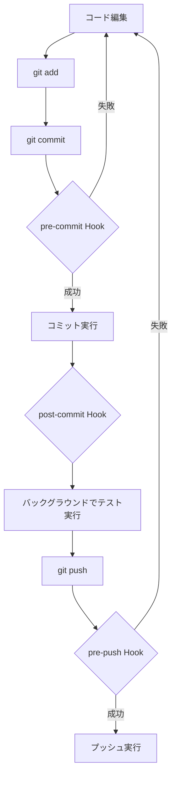
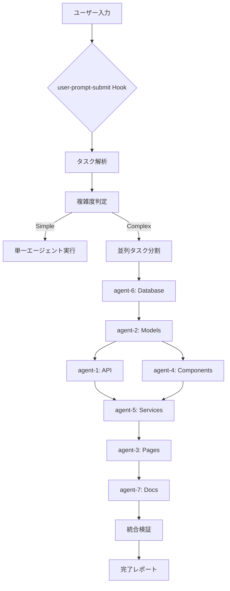

# 🪝 Hooks機能 - 並列開発自動化

このディレクトリには、Git操作とClaude Code操作に連動する4つのHooksが含まれています。

## 📁 ディレクトリ構造

```
.claude/hooks/
├── README.md                      # このファイル
├── parallel-development.json      # 並列開発設定（既存）
├── pre-commit.json               # コミット前の品質チェック
├── post-commit.json              # コミット後の自動テスト
├── pre-push.json                 # プッシュ前のコンフリクト検出
├── user-prompt-submit.json       # ユーザー入力時の並列タスク起動
└── logs/                         # Hook実行ログ
```

## 🔧 4つのHooks

### 1. pre-commit Hook
**トリガー**: `git commit` 実行前

**機能**:
- ✅ ESLintによるコード品質チェック
- ✅ Prettierによるフォーマットチェック（自動修正）
- ✅ デバッグステートメント検出
- ✅ TODOコメント警告
- ✅ ファイルサイズチェック
- ✅ コンフリクトマーカー検出
- ✅ シークレット情報検出

**バイパス**:
```bash
# 環境変数でスキップ
export SKIP_PRE_COMMIT=true
git commit -m "message"

# コミットメッセージでスキップ
git commit -m "[skip-hooks] emergency fix"
```

### 2. post-commit Hook
**トリガー**: `git commit` 実行後

**機能**:
- ✅ 変更されたファイルに関連するユニットテスト実行
- ✅ API変更時の統合テスト実行
- ✅ フロントエンド変更時のE2Eテスト（サンプル）
- ✅ コードカバレッジチェック
- ✅ 他のエージェントへの変更通知
- ✅ ビルドステータス更新

**バックグラウンド実行**:
テストはバックグラウンドで実行され、完了時に通知されます。

**バイパス**:
```bash
# テストをスキップ
export SKIP_POST_COMMIT=true
git commit -m "message"

# コミットメッセージでスキップ
git commit -m "[skip-tests] work in progress"
```

### 3. pre-push Hook
**トリガー**: `git push` 実行前

**機能**:
- ✅ リモートとの差分チェック
- ✅ 潜在的なコンフリクト検出（セマンティック解析）
- ✅ 他のエージェントのファイルロックチェック
- ✅ 全テストスイート実行
- ✅ ビルド成功確認（main/masterブランチ）
- ✅ コミットメッセージ形式チェック
- ✅ ブランチ保護ルール確認
- ✅ 最終コンフリクトチェック

**重要**: このHookはプッシュをブロックする可能性があります。

**バイパス**:
```bash
# 環境変数でスキップ
export SKIP_PRE_PUSH=true
git push

# Gitフラグでスキップ
git push --no-verify
```

### 4. user-prompt-submit Hook
**トリガー**: Claude Codeでユーザーがプロンプトを送信した時

**機能**:
- ✅ ユーザーリクエストの自然言語解析
- ✅ タスク複雑度の自動検出
- ✅ 適切なSubAgentへの自動割り当て
- ✅ 並列実行の可否判定
- ✅ タスク分割計画の自動作成
- ✅ エージェント間の実行調整
- ✅ 進捗モニタリング
- ✅ コンフリクト自動解決
- ✅ 統合検証
- ✅ 完了レポート生成

**タスクテンプレート**:

```javascript
// フルスタック機能実装
「チケット管理機能を実装」
→ 7つのエージェントが並列/順次実行

// バックエンドのみ
「チケットAPIを実装」
→ agent-6, agent-2, agent-1 が順次実行

// フロントエンドのみ
「チケット一覧画面を実装」
→ agent-4, agent-5, agent-3 が並列実行

// UIコンポーネントのみ
「ボタンコンポーネントを作成」
→ agent-4 のみが実行

// APIエンドポイントのみ
「チケット作成APIを追加」
→ agent-2, agent-1 が順次実行
```

**バイパス**:
```
# プロンプトに[no-parallel]を付けると並列実行をスキップ
[no-parallel] チケット管理機能を実装
```

## 🎯 実行フロー

### 開発者の通常フロー



### 並列開発フロー



## 📊 ログとモニタリング

### ログファイル

```bash
.claude/hooks/logs/
├── pre-commit-2026-01-24.log
├── post-commit-2026-01-24.log
├── pre-push-2026-01-24.log
└── user-prompt-submit-2026-01-24.log
```

### ログ形式

```json
{
  "timestamp": "2026-01-24T16:30:00Z",
  "hook": "pre-commit",
  "event": "started",
  "files_changed": 5,
  "checks_passed": 8,
  "checks_failed": 0,
  "duration_ms": 1234,
  "status": "success"
}
```

### ログ確認コマンド

```bash
# Windows PowerShell
Get-Content .claude/hooks/logs/pre-commit-*.log | Select-String "error"

# Linux/Bash
grep "error" .claude/hooks/logs/pre-commit-*.log
```

## 🔧 カスタマイズ

### Hook設定の変更

各Hookの設定ファイル（`*.json`）を編集：

```json
{
  "enabled": true,           // Hookを有効化
  "timeout_seconds": 120,    // タイムアウト時間
  "continue_on_error": false // エラー時も続行するか
}
```

### 並列実行数の変更

`user-prompt-submit.json`を編集：

```json
{
  "performance": {
    "max_concurrent_agents": 7  // 最大同時実行エージェント数
  }
}
```

### チェック項目の追加/削除

各Hookの`actions`配列を編集：

```json
{
  "actions": [
    {
      "name": "custom-check",
      "type": "command",
      "windows": { "command": "..." },
      "linux": { "command": "..." }
    }
  ]
}
```

## 🚨 トラブルシューティング

### Hook実行がスキップされる

```bash
# Hookが有効か確認
cat .claude/hooks/pre-commit.json | grep "enabled"

# 環境変数を確認
echo $SKIP_PRE_COMMIT
```

### Hook実行が失敗する

```bash
# ログを確認
cat .claude/hooks/logs/pre-commit-*.log | tail -50

# エラー詳細を確認
grep -A 10 "error" .claude/hooks/logs/*.log
```

### 並列実行でコンフリクト

```bash
# アクティブなロックを確認
ls -la .claude/agents/locks/

# ロックをクリーンアップ（注意: 実行中のタスクがないことを確認）
rm -rf .claude/agents/locks/*
```

### テストが遅い

```bash
# バックグラウンド実行を有効化
# post-commit.json を編集
"background_execution": true
```

## 🎨 Windows/Linux両対応

全てのHooksはWindows PowerShellとLinux Bashの両方に対応しています：

### Windows実行例

```powershell
# pre-commit
powershell -NoProfile -Command "npm run lint"

# post-commit（バックグラウンド）
Start-Job -ScriptBlock { npm run test }

# pre-push
powershell -NoProfile -Command "git fetch origin && npm run test"
```

### Linux実行例

```bash
# pre-commit
npm run lint

# post-commit（バックグラウンド）
npm run test &

# pre-push
git fetch origin && npm run test
```

## 📚 関連ドキュメント

- `.claude/agents/README.md` - SubAgent並列開発システム
- `.claude/ADVANCED_FEATURES.md` - SubAgentとHooksの詳細
- `CLAUDE.md` - プロジェクト全体の設計指針

---

**作成日**: 2026-01-24
**最終更新**: 2026-01-24
