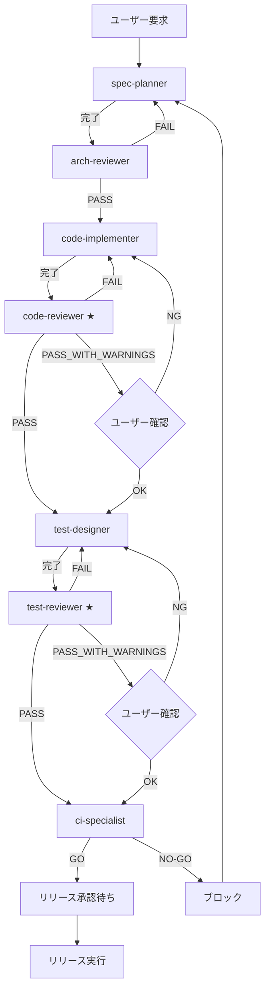

# 🔄 工程管理SubAgent - 事故らない開発レーン

このディレクトリには、**工程管理別の7つのSubAgent**と**自動レビューゲート**が含まれています。

## 🎯 目的

このシステムは、

* **人のミスを前提**に
* **AI に関所をやらせ**
* **ログを残し**
* **監査に耐え**
* **将来の自分を助ける**

ための**"事故らない開発環境"**です。

---

## 🧠 工程管理SubAgent 7体

### 実行順序（必須）

```
1. spec-planner        （要件定義）
        ↓
2. arch-reviewer       （設計レビュー）
        ↓
3. code-implementer    （実装）
        ↓
4. code-reviewer       （コードレビューゲート）★
        ↓
5. test-designer       （テスト設計）
        ↓
6. test-reviewer       （テストレビューゲート）★
        ↓
7. ci-specialist       （CI/リリース判定）★
```

**★ = 自動レビューゲート（PASS/FAIL/PASS_WITH_WARNINGS判定）**

---

## 📋 各Agent詳細

### 1. spec-planner（要件・運用定義）

**責務**:
- 目的・スコープ・KGI/KPI を明確化
- 機能要件 / 非機能要件を定義
- ITSM / ISO20000 / ISO27001 観点を反映

**成果物**:
- `specs/overview.md`
- `specs/requirements.md`
- `specs/kpi-kgi.md`
- `specs/compliance.md`

**完了条件**:
- 全ての必須セクションが記載されている
- 測定可能なKPIが定義されている
- SOD原則が記載されている

**次のフェーズ**: → arch-reviewer（自動起動）

---

### 2. arch-reviewer（設計レビュー）

**責務**:
- アーキテクチャ妥当性検証
- データフロー / 権限モデル検証
- 将来拡張性・単一障害点・SoD チェック

**成果物**:
- `design/architecture.md`
- `design/security.md`
- `design/data-model.md`
- `design/api-spec.md`
- `reviews/arch-review-YYYYMMDD.json` ★

**レビュー観点**:
- レイヤー分離
- 単一障害点（SPOF）
- SOD原則
- 監査証跡設計
- セキュリティ

**判定**:
- **PASS**: code-implementer へ自動進行
- **FAIL**: spec-planner へ差し戻し
- **PASS_WITH_WARNINGS**: ユーザー確認後に進行

---

### 3. code-implementer（実装）

**責務**:
- 設計書に基づく実装
- 仕様外実装の禁止
- ログ・例外処理・設定外出しの必須化

**成果物**:
- `src/**/*.js`
- 実装完了報告

**厳格ルール**:
- ❌ 仕様外実装の禁止
- ❌ ハードコード禁止
- ❌ エラー処理なしのコード禁止
- ❌ ログなしの重要処理禁止

**必須実装項目**:
- 全ての非同期処理にtry/catch
- 重要操作に成功/失敗ログ
- 環境変数または config/ から設定値取得
- 認証・承認・M365操作に監査ログ

**次のフェーズ**: → code-reviewer（自動起動）

---

### 4. code-reviewer（自動レビューゲート）★

**責務**:
- 仕様・設計・運用要件準拠チェック
- 例外処理・ログ・権限・将来耐性チェック
- 機械判定可能なゲート結果出力

**成果物**:
- `reviews/code-review-YYYYMMDD-feature-xxx.json` ★

**レビュー観点**:

| カテゴリ | 重要度 | チェック項目 |
|---------|--------|-------------|
| **仕様準拠** | Critical | 入出力仕様、要件網羅性、仕様外実装 |
| **例外処理** | Critical | try/catch網羅、異常終了防止、エラーログ |
| **ログ・監査** | Critical | 成功/失敗ログ、監査証跡、追記専用保護 |
| **権限・SOD** | Critical | 権限チェック、SOD原則、管理系制限 |
| **設定外出し** | High | ハードコード、シークレット、環境変数 |
| **将来耐性** | Medium | 魔法の数値、依存注入、テスタビリティ |

**判定ルール**:
```
FAIL:                   blocking_issues > 0
PASS_WITH_WARNINGS:     blocking_issues == 0 AND warnings > 0
PASS:                   blocking_issues == 0 AND warnings == 0
```

**次のフェーズ**:
- **FAIL**: → code-implementer へ自動差し戻し
- **PASS_WITH_WARNINGS**: → ユーザー確認 → test-designer
- **PASS**: → test-designer へ自動進行

---

### 5. test-designer（テスト設計）

**責務**:
- 正常系 / 異常系 / 境界値 / 権限系テスト定義
- 監査・証跡観点のテスト定義

**成果物**:
- `tests/test-cases.md`
- `tests/unit/**/*.test.js`
- `tests/integration/**/*.test.js`
- `tests/e2e/**/*.spec.js`

**必須テスト項目**:
- 承認フロー（正常承認、却下、SOD違反検出）
- M365操作（承認済み実行、未承認ブロック、実施ログ記録）
- 監査ログ（自動記録、削除不可、改ざん防止）
- 権限（各ロールができること/できないこと）
- SLA計算（優先度計算、期限計算、超過検出）

**カバレッジ目標**:
- ユニットテスト: 80%
- 統合テスト: 70%
- E2Eテスト: クリティカルパス100%

**次のフェーズ**: → test-reviewer（自動起動）

---

### 6. test-reviewer（テストレビューゲート）★

**責務**:
- テスト網羅性レビュー
- 重要機能・異常系抜け漏れ検出

**成果物**:
- `reviews/test-review-YYYYMMDD.json` ★

**レビュー観点**:
- カバレッジ分析（最低60%、目標80%）
- 重要機能のテスト存在確認
- 異常系・境界値テスト確認
- RBAC テスト確認
- 監査証跡テスト確認

**判定ルール**:
```
FAIL:                   blocking_issues > 0 OR coverage < threshold(60%)
PASS_WITH_WARNINGS:     blocking_issues == 0 AND (warnings > 0 OR coverage < target(80%))
PASS:                   blocking_issues == 0 AND warnings == 0 AND coverage >= target
```

**次のフェーズ**:
- **FAIL**: → test-designer へ自動差し戻し
- **PASS_WITH_WARNINGS**: → ユーザー確認 → ci-specialist
- **PASS**: → ci-specialist へ自動進行

---

### 7. ci-specialist（CI / リリース）

**責務**:
- 自動テスト実行設計
- ビルド / リリース / ロールバック設計
- 品質ゲート結果に基づく GO / NO-GO 判定

**成果物**:
- `ci/pipeline.md`
- `ci/release-checklist.md`
- `ci/rollback-procedure.md`
- `ci/gate-result-YYYYMMDD.json` ★

**パイプラインステージ**:
1. ビルド
2. 静的解析（ESLint/Prettier）
3. ユニットテスト（カバレッジ≥60%）
4. 統合テスト
5. E2Eテスト（クリティカルパス）
6. セキュリティスキャン（npm audit）
7. 品質ゲート判定

**GO/NO-GO判定**:

**GO条件**:
- ✅ 全ステージPASS
- ✅ code-review == PASS or PASS_WITH_WARNINGS
- ✅ test-review == PASS or PASS_WITH_WARNINGS
- ✅ カバレッジ ≥ 60%
- ✅ critical/high脆弱性なし

**NO-GO条件**:
- ❌ いずれかのステージFAIL
- ❌ code-review == FAIL
- ❌ test-review == FAIL
- ❌ critical脆弱性あり

**リリース判定**:
- **GO**: 手動承認 → リリース実行
- **NO-GO**: リリースブロック → 修正必須

---

## 🔄 ワークフローフロー図



---

## 🪝 Hooks連携ルール

### ① on-spec-complete
```
WHEN: spec-planner が成果物を出力
THEN: arch-reviewer を自動起動（specs/* を入力）
```

### ② on-arch-approved
```
WHEN: arch-reviewer が PASS を返却
THEN: code-implementer を起動（design/* を入力）
```

### ③ on-implementation-complete
```
WHEN: code-implementer が「実装完了」と宣言
THEN: code-reviewer を自動起動（変更ファイル/specs/design を渡す）
```

### ④ on-code-review-result
```
IF result == FAIL:
  → code-implementer に自動差し戻し

IF result == PASS_WITH_WARNINGS:
  → ユーザーに通知 → 承認後にtest-designer起動

IF result == PASS:
  → test-designer を自動起動
```

### ⑤ on-test-design-complete
```
WHEN: test-designer が成果物を出力
THEN: test-reviewer を自動起動
```

### ⑥ on-test-review-result
```
IF result == FAIL:
  → test-designer に差し戻し

IF result == PASS:
  → ci-specialist を自動起動
```

### ⑦ on-release-decision
```
IF decision == GO:
  → 手動承認待ち → リリース実行

IF decision == NO-GO:
  → リリースブロック → 修正必須
```

---

## 🔒 並列開発ルール（コンフリクト防止）

### 機能領域別エージェント連携

```
code-implementer（工程管理）
    ├─ agent-6-database（機能実装）
    ├─ agent-2-backend-models（機能実装）
    ├─ agent-1-backend-api（機能実装）
    ├─ agent-4-frontend-components（機能実装）
    ├─ agent-5-frontend-services（機能実装）
    └─ agent-3-frontend-pages（機能実装）
```

**ルール**:
- 各 functional agent は **1ファイルツリーのみ** を担当
- 同一ファイルへの同時書き込みは禁止
- 共有設定は `config/*` に集約
- 競合発生時は `spec-planner` に強制エスカレーション

---

## 🛂 自動レビューゲート詳細

### code-reviewer ゲート

#### レビュー観点

```yaml
仕様準拠:
  - 入出力が仕様どおりか
  - 要件抜けがないか
  - 仕様外実装がないか（禁止）

例外処理:
  - try/catch があるか
  - エラー時に異常終了しないか
  - エラーログがあるか

ログ・証跡:
  - 成功ログがあるか
  - 失敗ログがあるか
  - 誰が何をしたか残るか（監査ログ）
  - 追記専用ログにUPDATE/DELETEがないか

権限・SoD:
  - 権限チェックがあるか
  - 承認者≠実施者のチェックがあるか
  - 管理系操作が無制限でないか

将来変更耐性:
  - ハードコード排除
  - 設定値外出し
  - テスタビリティ

セキュリティ:
  - SQLインジェクション対策
  - XSS対策
  - シークレット検出
  - 認証バイパス防止
```

#### ゲート出力フォーマット

```json
{
  "result": "PASS | FAIL | PASS_WITH_WARNINGS",
  "summary": "総評",
  "blocking_issues": [
    {
      "category": "security",
      "severity": "critical",
      "file": "src/api/controllers/TicketController.js",
      "line": 42,
      "description": "SQLインジェクションの脆弱性",
      "code_snippet": "...",
      "recommendation": "プリペアドステートメントを使用"
    }
  ],
  "warnings": [],
  "approved_files": ["src/models/Ticket.js"],
  "timestamp": "2026-01-24T18:00:00Z"
}
```

#### 判定ルール

```
blocking_issues > 0           → FAIL
blocking_issues = 0 & warnings > 0  → PASS_WITH_WARNINGS
blocking_issues = 0 & warnings = 0  → PASS
```

---

### test-reviewer ゲート

#### レビュー観点

```yaml
カバレッジ分析:
  - ユニットテスト: ≥60%（最低）/ ≥80%（目標）
  - 統合テスト: ≥50%（最低）/ ≥70%（目標）
  - E2Eテスト: クリティカルパス100%

重要機能テスト:
  - チケット作成
  - 承認フロー
  - M365操作
  - 監査ログ
  - SLA計算

異常系テスト:
  - エラーハンドリング
  - 権限エラー
  - バリデーションエラー
  - タイムアウト

RBAC テスト:
  - 各ロールができること/できないこと
  - 権限昇格試行の防止
```

#### 判定ルール

```
blocking_issues > 0 OR coverage < 60%  → FAIL
blocking_issues = 0 AND warnings > 0   → PASS_WITH_WARNINGS
blocking_issues = 0 AND coverage ≥ 80% → PASS
```

---

### ci-specialist ゲート

#### パイプラインステージ

```
1. ビルド              → ビルドエラーなし
2. 静的解析            → リントエラーなし
3. ユニットテスト       → 全PASS & カバレッジ≥60%
4. 統合テスト          → 全PASS
5. E2Eテスト           → クリティカルパス全PASS
6. セキュリティスキャン  → critical/high脆弱性なし
7. 品質ゲート判定       → 全ゲートPASS
```

#### GO/NO-GO判定

**GO条件**:
- ✅ 全ステージPASS
- ✅ code-review: PASS or PASS_WITH_WARNINGS
- ✅ test-review: PASS or PASS_WITH_WARNINGS

**NO-GO条件**:
- ❌ いずれかのステージFAIL
- ❌ code-review: FAIL
- ❌ test-review: FAIL

---

## 🚀 使用方法

### 新機能開発フロー

```javascript
// 1. 要件定義
「チケット管理機能の要件を定義してください」
→ spec-planner が specs/* を作成
→ 自動的に arch-reviewer が起動

// 2. 設計レビュー（自動）
→ arch-reviewer がレビュー
→ PASS の場合、自動的に code-implementer が起動

// 3. 実装（自動 + 並列）
→ code-implementer が方針決定
→ functional agents (agent-1～7) が並列実装
→ 完了後、自動的に code-reviewer が起動

// 4. コードレビューゲート（自動）
→ code-reviewer が自動検証
→ PASS の場合、自動的に test-designer が起動
→ FAIL の場合、code-implementer へ差し戻し

// 5. テスト設計（自動）
→ test-designer がテストケース作成
→ 完了後、自動的に test-reviewer が起動

// 6. テストレビューゲート（自動）
→ test-reviewer がカバレッジ検証
→ PASS の場合、自動的に ci-specialist が起動

// 7. CI/リリース判定（自動）
→ ci-specialist がパイプライン実行
→ GO の場合、リリース承認待ち
→ NO-GO の場合、ブロック
```

### 差し戻しフロー

```
code-reviewer FAIL
    ↓
code-implementer 再実装
    ↓
code-reviewer 再レビュー
    ↓
PASS → test-designer へ進行
```

---

## 🛡️ 絶対ルール（運用ポリシー）

### ❌ 禁止事項

1. **工程スキップ禁止**
   - spec → arch → code → review → test → review → ci の順序厳守
   - ユーザーが `[skip-gate:phase-N]` を明示した場合のみ例外

2. **Hook を通らない遷移は禁止**
   - 全ての工程遷移は Hooks 経由

3. **レビュー FAIL は必ず差し戻す**
   - code-reviewer FAIL → code-implementer へ差し戻し
   - test-reviewer FAIL → test-designer へ差し戻し

4. **仕様外実装は禁止**
   - specs/* に書いていないことは実装不可
   - 追加機能は spec-planner からやり直し

5. **設計に書いていないことは未実装扱い**
   - design/* に書いていないことは実装不可

---

## 📊 ディレクトリ構造

```
.claude/workflow-agents/
├── README.md                          # このファイル
├── 1-spec-planner.json               # 要件定義Agent
├── 2-arch-reviewer.json              # 設計レビューAgent
├── 3-code-implementer.json           # 実装Agent
├── 4-code-reviewer.json              # コードレビューゲートAgent ★
├── 5-test-designer.json              # テスト設計Agent
├── 6-test-reviewer.json              # テストレビューゲートAgent ★
├── 7-ci-specialist.json              # CI/リリースAgent ★
├── reviews/                           # レビュー結果
│   ├── arch-review-*.json
│   ├── code-review-*.json
│   └── test-review-*.json
├── specs/                             # 要件定義
│   ├── overview.md
│   ├── requirements.md
│   └── compliance.md
├── design/                            # 設計書
│   ├── architecture.md
│   ├── security.md
│   └── data-model.md
├── logs/                              # ワークフローログ
└── reports/                           # 週次レポート
```

---

## 🎯 機能領域別エージェントとの連携

### 2層エージェント構造

```
【工程管理層】（このディレクトリ）
spec-planner → arch-reviewer → code-implementer → code-reviewer
→ test-designer → test-reviewer → ci-specialist

【機能実装層】（.claude/agents/）
agent-6-database, agent-2-backend-models, agent-1-backend-api,
agent-4-frontend-components, agent-5-frontend-services,
agent-3-frontend-pages, agent-7-docs
```

**連携方法**:
- **code-implementer** が全体方針を決定
- **functional agents** が並列で詳細実装
- **code-reviewer** が全体をレビュー

---

## 📚 関連ドキュメント

- `.claude/agents/README.md` - 機能領域別SubAgent（agent-1～7）
- `.claude/hooks/workflow-gates.json` - ワークフローHooks設定
- `.claude/hooks/README.md` - Git Hooks（pre-commit等）
- `CLAUDE.md` - プロジェクト全体設計指針

---

## 🎉 これで完成！

**"事故らない開発レーン"**が完成しました。

すべての作業は：
- ✅ SubAgent 経由で行われ
- ✅ レビューゲートを通過し
- ✅ 判断が証跡として残る

**安心して開発を進めてください！** 🚀

---

**作成日**: 2026-01-24
**最終更新**: 2026-01-24
