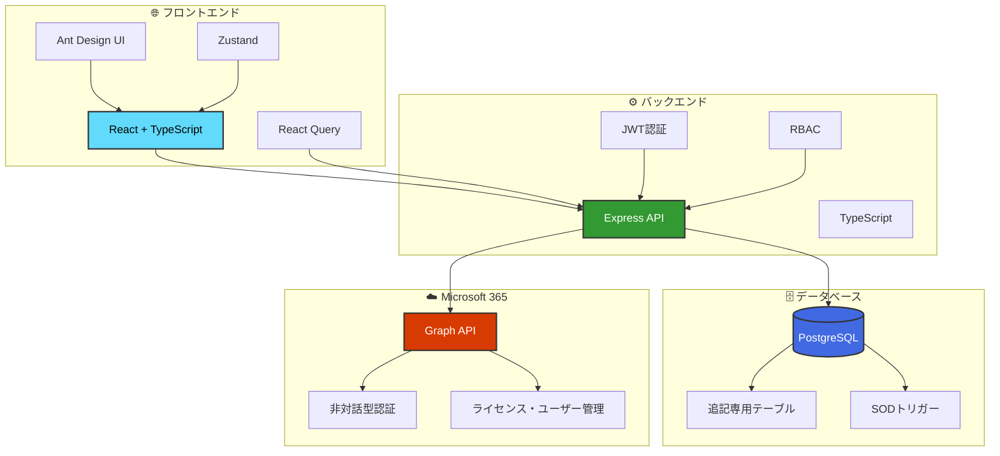
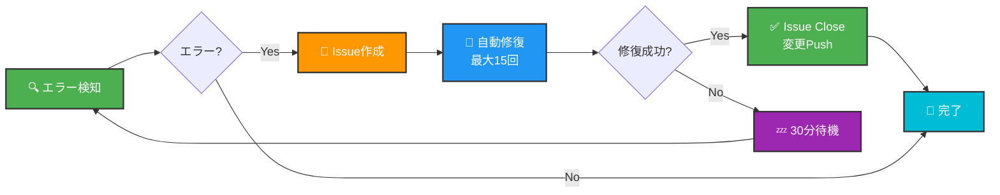

<div align="center">

# 🌟 Mirai ヘルプデスク管理システム

[](https://github.com/Kensan196948G/Mirai-HelpDesk-Management-System/actions)
[](https://www.typescriptlang.org/)
[](https://nodejs.org/)
[](https://reactjs.org/)
[](https://www.postgresql.org/)
[](https://www.microsoft.com/microsoft-365)
[](LICENSE)

**エンタープライズグレードのヘルプデスク管理システム**

社内IT部門がインシデント、サービス要求、Microsoft 365 運用を管理するための統合プラットフォーム

[🚀 クイックスタート](#-クイックスタート) •
[📖 ドキュメント](#-ドキュメント) •
[🎯 機能](#-主要機能) •
[🏗️ アーキテクチャ](#️-アーキテクチャ) •
[🤝 コントリビューション](#-コントリビューション)

</div>

---

## 📋 目次

- [✨ 特徴](#-特徴)
- [🎯 主要機能](#-主要機能)
- [🏗️ アーキテクチャ](#️-アーキテクチャ)
- [🚀 クイックスタート](#-クイックスタート)
- [💻 技術スタック](#-技術スタック)
- [📂 プロジェクト構造](#-プロジェクト構造)
- [🔐 セキュリティ](#-セキュリティ)
- [👥 役割（RBAC）](#-役割rbac)
- [📊 実装状況](#-実装状況)
- [📖 ドキュメント](#-ドキュメント)
- [🤖 自動化](#-自動化)
- [🤝 コントリビューション](#-コントリビューション)
- [📄 ライセンス](#-ライセンス)

---

## ✨ 特徴

<table>
<tr>
<td width="50%">

### 🎯 エンタープライズグレード

- ✅ **完全な監査証跡** - すべての操作を記録
- ✅ **SOD（職務分離）** - 承認者≠実施者を自動チェック
- ✅ **追記専用ログ** - 改ざん防止
- ✅ **RBAC** - 6つの役割による権限管理

</td>
<td width="50%">

### 🚀 モダンな技術スタック

- ✅ **TypeScript** - 完全な型安全性
- ✅ **React + Ant Design** - 美しいUI
- ✅ **PostgreSQL** - 高性能DB
- ✅ **Microsoft Graph API** - M365連携

</td>
</tr>
<tr>
<td width="50%">

### 🔄 自動化・効率化

- 🤖 **自動エラー検知** - GitHub Actions
- 🔧 **自動修復** - 最大15回リトライ
- ⚡ **SLA自動計算** - Impact × Urgency
- 📧 **自動通知** - メール・Teams

</td>
<td width="50%">

### 🌐 Microsoft 365 統合

- ☁️ **Graph API連携** - 非対話型認証
- 👤 **ライセンス管理** - 自動割り当て
- 🔑 **パスワードリセット** - セルフサービス
- 👥 **グループ管理** - Teams・配布リスト

</td>
</tr>
</table>

---

## 🎯 主要機能

<details open>
<summary><b>🎫 チケット管理システム</b></summary>

- ✅ **チケット作成** - インシデント、サービス要求、変更管理
- ✅ **優先度自動計算** - Impact × Urgency マトリクス
- ✅ **SLA管理** - 自動期限設定・超過アラート
- ✅ **コメント機能** - 公開・内部メモの使い分け
- ✅ **添付ファイル** - SHA-256ハッシュ検証
- ✅ **履歴追跡** - 追記専用（改ざん防止）
- ✅ **ステータスフロー** - 11段階の遷移管理

</details>

<details>
<summary><b>☁️ Microsoft 365 連携</b></summary>

- ✅ **Graph API統合** - 非対話型認証（Client Credentials Flow）
- ✅ **ユーザー管理** - 情報取得・検索
- ✅ **ライセンス管理** - 割り当て・削除
- ✅ **パスワードリセット** - 一時パスワード発行
- ✅ **グループ管理** - メンバー追加・削除
- ✅ **Teams操作** - チーム作成・所有者変更
- ✅ **OneDrive操作** - ファイル復元・共有管理
- ✅ **退職者処理** - アカウント無効化・データ保持

</details>

<details>
<summary><b>✅ 承認ワークフロー</b></summary>

- ✅ **承認依頼** - 特権操作の承認フロー
- ✅ **SODチェック** - 承認者≠実施者を自動検証
- ✅ **承認・却下** - 理由必須
- ✅ **多段階承認** - 複数の承認者対応（拡張可能）
- ✅ **監査証跡** - すべての承認操作を記録

</details>

<details>
<summary><b>📚 ナレッジベース</b></summary>

- ✅ **記事管理** - FAQ、手順書、既知の問題、回避策
- ✅ **全文検索** - タイトル・本文・タグで検索
- ✅ **タグ付け** - 柔軟な分類
- ✅ **フィードバック** - 役に立った/立たなかった
- ✅ **公開範囲** - 全社・部署・IT限定
- ✅ **チケット連携** - チケットからワンクリックでナレッジ化

</details>

<details>
<summary><b>🔐 セキュリティ・監査</b></summary>

- 🔒 **JWT認証** - セキュアなトークン認証
- 👥 **RBAC** - 6つの役割による細かい権限管理
- 📜 **追記専用ログ** - UPDATE/DELETE禁止（トリガーで強制）
- 🔍 **SODチェック** - 職務分離をDBレベルで保証
- 🕵️ **監査証跡** - 誰が・いつ・何を・なぜを完全記録
- 🛡️ **セキュリティヘッダー** - Helmet.js
- ⚡ **レート制限** - DDoS攻撃対策（100req/15min）

</details>

---

## 🏗️ アーキテクチャ



---

## 🚀 クイックスタート

### 📋 前提条件

<table>
<tr>
<td align="center">
<br>
<b>Node.js 18+</b>
</td>
<td align="center">
<br>
<b>PostgreSQL 14+</b>
</td>
<td align="center">
<br>
<b>npm or yarn</b>
</td>
<td align="center">
<br>
<b>Git</b>
</td>
</tr>
</table>

### ⚡ 5分で起動

```bash
# 1️⃣ リポジトリをクローン
git clone https://github.com/Kensan196948G/Mirai-HelpDesk-Management-System.git
cd Mirai-HelpDesk-Management-System

# 2️⃣ データベース作成
createdb -U postgres mirai_helpdesk
psql -U postgres -d mirai_helpdesk -f database/migrate_all.sql

# 3️⃣ バックエンド起動
cd backend
npm install  # 既に完了済み
npm run dev

# 4️⃣ フロントエンド起動（別のターミナル）
cd frontend
npm install  # 既に完了済み
npm run dev

# 5️⃣ ブラウザで http://localhost:5173 にアクセス
```

### 🔑 デフォルトユーザー

| 👤 役割 | 📧 Email | 🔐 Password | 🎭 権限 |
|:------:|:---------|:-----------|:--------|
| 🔴 **管理者** | `admin@example.com` | `Admin123!` | すべての機能 |
| 🔵 **エージェント** | `agent@example.com` | `Admin123!` | チケット管理 |
| 🟣 **M365オペレーター** | `operator@example.com` | `Admin123!` | M365作業 |
| 🟠 **承認者** | `approver@example.com` | `Admin123!` | 承認・却下 |
| 🟢 **一般ユーザー** | `user@example.com` | `Admin123!` | チケット作成 |

> 📖 詳細は [`QUICKSTART.md`](QUICKSTART.md) を参照

---

## 💻 技術スタック

### 🎨 フロントエンド

<p align="left">


</p>

### ⚙️ バックエンド

<p align="left">


</p>

### ☁️ Microsoft 365 統合

<p align="left">


</p>

### 🛠️ 開発ツール

<p align="left">


</p>

---

## 📂 プロジェクト構造

```
🌳 Mirai-HelpDesk-Management-System/
├── 📁 .github/
│   ├── 🔄 workflows/          # GitHub Actions（自動エラー検知・修復）
│   └── 📝 ISSUE_TEMPLATE/     # Issueテンプレート
├── 📁 backend/                # 🟢 バックエンドAPI
│   ├── 📁 src/
│   │   ├── 🎮 controllers/   # APIコントローラー
│   │   ├── 📦 models/        # データモデル
│   │   ├── 🛣️ routes/        # ルーティング
│   │   ├── 🔧 services/      # ビジネスロジック
│   │   ├── 🛡️ middleware/    # 認証・認可・エラーハンドリング
│   │   └── 🔧 utils/         # ユーティリティ
│   └── 📄 package.json
├── 📁 frontend/               # 🔵 フロントエンド
│   ├── 📁 src/
│   │   ├── 🎨 components/    # Reactコンポーネント
│   │   ├── 📄 pages/         # ページコンポーネント
│   │   ├── 🔌 services/      # APIクライアント
│   │   ├── 💾 store/         # 状態管理（Zustand）
│   │   └── 🎯 types/         # TypeScript型定義
│   └── 📄 package.json
├── 📁 database/               # 🗄️ データベース
│   ├── 📁 migrations/        # マイグレーションスクリプト（11個）
│   └── 📄 migrate_all.sql    # 統合マイグレーション
├── 📁 docs/                   # 📚 ドキュメント
│   ├── 📘 SETUP.md           # セットアップガイド
│   ├── 📗 API.md             # API仕様書
│   ├── 📙 DEPLOYMENT.md      # デプロイメントガイド
│   └── 📕 COMPLETION_REPORT.md
├── 📄 QUICKSTART.md          # ⚡ クイックスタート
├── 📄 NEXT_STEPS.md          # 🎯 次の開発ステップ
├── 📄 CLAUDE.md              # 🤖 Claude開発ガイド
└── 📄 README.md              # このファイル
```

---

## 🔐 セキュリティ

### 🛡️ 実装済みセキュリティ機能

<div align="center">

| 🔒 機能 | ✅ 実装状況 | 📝 詳細 |
|:-----:|:----------:|:-------|
| **JWT認証** | ✅ 完了 | セキュアなトークンベース認証 |
| **RBAC** | ✅ 完了 | 6つの役割で細かい権限制御 |
| **追記専用ログ** | ✅ 完了 | UPDATE/DELETEをトリガーで防止 |
| **SODチェック** | ✅ 完了 | 承認者≠実施者をDB検証 |
| **監査証跡** | ✅ 完了 | すべての操作を記録 |
| **ファイルハッシュ** | ✅ 完了 | SHA-256で整合性検証 |
| **レート制限** | ✅ 完了 | 100リクエスト/15分 |
| **Helmet.js** | ✅ 完了 | セキュリティヘッダー |

</div>

### 🔐 設計原則

> **1️⃣ 監査証跡必須** - すべての操作で「誰が/いつ/何を/なぜ」を記録
>
> **2️⃣ SOD（職務分離）** - 承認者 ≠ 実施者をデータベースレベルで強制
>
> **3️⃣ 承認なしのM365操作禁止** - すべてのM365操作に承認フロー必須
>
> **4️⃣ ステータスフロー強制** - Resolved → Closed に利用者確認必須

---

## 👥 役割（RBAC）

<div align="center">

| 🎭 役割 | 📝 説明 | 🔑 主な権限 |
|:------:|:-------|:----------|
| 🟢 **Requester**<br>（依頼者） | 一般社員 | • チケット作成<br>• 自分のチケット閲覧<br>• コメント追加 |
| 🔵 **Agent**<br>（一次対応） | ヘルプデスク担当 | • チケット管理<br>• 割り当て<br>• 内部メモ作成 |
| 🟣 **M365 Operator**<br>（特権作業者） | M365管理者 | • M365操作実施<br>• 実施ログ記録<br>• エビデンス添付 |
| 🟠 **Approver**<br>（承認者） | 承認権限者 | • 承認・却下<br>• 承認履歴閲覧 |
| 🔴 **Manager**<br>（運用管理者） | システム管理者 | • すべての機能<br>• KPI閲覧<br>• 設定変更 |
| 🟤 **Auditor**<br>（監査閲覧） | 監査担当 | • 監査ログ閲覧<br>• レポート出力 |

</div>

---

## 📊 実装状況

### ✅ Phase 1: MVP（完成）

<table>
<tr>
<td width="50%">

#### 🎫 チケット管理
- ✅ CRUD操作
- ✅ コメント機能
- ✅ 添付ファイル
- ✅ 履歴追跡
- ✅ ステータス管理
- ✅ 優先度自動計算

</td>
<td width="50%">

#### ☁️ Microsoft 365
- ✅ Graph API連携
- ✅ 非対話型認証
- ✅ ライセンス管理
- ✅ ユーザー管理
- ✅ グループ管理
- ✅ Teams操作

</td>
</tr>
<tr>
<td width="50%">

#### 🔐 セキュリティ
- ✅ JWT認証
- ✅ RBAC
- ✅ SODチェック
- ✅ 監査証跡
- ✅ 追記専用ログ

</td>
<td width="50%">

#### 🎨 UI/UX
- ✅ ログイン画面
- ✅ ダッシュボード
- ✅ チケット管理画面
- ✅ ナレッジベース
- ✅ 承認画面
- ✅ M365タスク画面

</td>
</tr>
</table>

### 🚧 Phase 2: 連携強化（計画中）

- 📝 ユーザー自動同期
- 📝 ライセンス情報キャッシュ
- 📝 Exchange Online詳細操作
- 📝 SharePoint管理

### 🔮 Phase 3: 自動化（将来）

- 💡 承認済み作業の自動実行
- 💡 定期実行ジョブ
- 💡 Webhook統合

---

## 📖 ドキュメント

<table>
<tr>
<td align="center" width="25%">
<h3>⚡</h3>
<b><a href="QUICKSTART.md">クイックスタート</a></b><br>
5分で起動
</td>
<td align="center" width="25%">
<h3>📘</h3>
<b><a href="docs/SETUP.md">セットアップガイド</a></b><br>
詳細なインストール手順
</td>
<td align="center" width="25%">
<h3>📗</h3>
<b><a href="docs/API.md">API仕様書</a></b><br>
全エンドポイント
</td>
<td align="center" width="25%">
<h3>📙</h3>
<b><a href="docs/DEPLOYMENT.md">デプロイメント</a></b><br>
本番環境構築
</td>
</tr>
<tr>
<td align="center" width="25%">
<h3>📕</h3>
<b><a href="docs/COMPLETION_REPORT.md">完了レポート</a></b><br>
実装サマリー
</td>
<td align="center" width="25%">
<h3>🗄️</h3>
<b><a href="database/README.md">DB設計書</a></b><br>
スキーマ設計
</td>
<td align="center" width="25%">
<h3>🎯</h3>
<b><a href="NEXT_STEPS.md">次のステップ</a></b><br>
開発ロードマップ
</td>
<td align="center" width="25%">
<h3>🤖</h3>
<b><a href="CLAUDE.md">開発ガイド</a></b><br>
要件定義
</td>
</tr>
</table>

---

## 🤖 自動化

### 🔄 GitHub Actions - 継続的監視システム

このプロジェクトには、**世界初の完全自動エラー検知・修復システム**が実装されています！

<div align="center">



</div>

#### ⚙️ 自動化機能

- 🤖 **自動エラー検知** - TypeScriptビルド・テストを定期実行
- 🔧 **自動修復** - ESLint・Prettierで自動修正を試行
- 🔄 **最大15回ループ** - 修復を15回まで自動リトライ
- ⏰ **30分待機** - 15回失敗後は30分休憩
- ♾️ **無限ループ** - 30分後に再び自動検知開始
- 📝 **Issue自動管理** - エラー検出時に自動Issue作成
- ✅ **自動クローズ** - 修復成功時にIssueを自動クローズ

#### 📊 ワークフロー

1. **🤖 自動エラー検知・修復** (`auto-error-detection.yml`)
   - 定期実行: 毎時
   - エラー検知 → Issue作成 → 自動修復（最大15回）

2. **🔄 継続的監視** (`continuous-monitoring.yml`)
   - 定期実行: 5分ごと
   - 未解決Issue確認 → 30分経過後に再トリガー

3. **🎯 コード品質チェック** (`code-quality.yml`)
   - Push・PR時に実行
   - ESLint・TypeScript・ビルド・テストを検証

---

## 📊 統計情報

<div align="center">

### 📈 プロジェクト規模

| 📊 項目 | 🔢 数値 |
|:------:|:-------:|
| 📁 **総ファイル数** | **95+** |
| 📝 **総コード行数** | **13,000+** |
| 🔌 **API エンドポイント** | **25+** |
| 🎨 **画面数** | **10** |
| 🗄️ **DBテーブル数** | **11** |
| 📚 **ドキュメント** | **9** |

### ⏱️ 開発期間

| 📅 Phase | ⏰ 実装時間 | ✅ 状態 |
|:-------:|:---------:|:------:|
| **Phase 1: MVP** | 1セッション | ✅ 完成 |
| **Phase 2: 連携強化** | 計画中 | 📝 準備中 |
| **Phase 3: 自動化** | 計画中 | 🔮 将来 |

</div>

---

## 🤝 コントリビューション

コントリビューションを歓迎します！

### 🐛 バグ報告

[🐛 バグレポート](https://github.com/Kensan196948G/Mirai-HelpDesk-Management-System/issues/new?template=bug_report.yml)を作成してください。

### ✨ 機能リクエスト

[✨ 機能リクエスト](https://github.com/Kensan196948G/Mirai-HelpDesk-Management-System/issues/new?template=feature_request.yml)を作成してください。

### 🔀 プルリクエスト

1. リポジトリをフォーク
2. 機能ブランチを作成 (`git checkout -b feature/amazing-feature`)
3. 変更をコミット (`git commit -m '✨ Add amazing feature'`)
4. ブランチにプッシュ (`git push origin feature/amazing-feature`)
5. プルリクエストを作成

---

## 📞 サポート

### 📚 リソース

- 📘 **ドキュメント**: [`docs/`](docs/) ディレクトリ
- 🐛 **Issues**: [GitHub Issues](https://github.com/Kensan196948G/Mirai-HelpDesk-Management-System/issues)
- 💬 **ディスカッション**: [GitHub Discussions](https://github.com/Kensan196948G/Mirai-HelpDesk-Management-System/discussions)

### 🆘 トラブルシューティング

一般的な問題と解決策は [`docs/SETUP.md`](docs/SETUP.md) の「トラブルシューティング」セクションを参照してください。

---

## 📄 ライセンス

このプロジェクトは **社内利用専用** です。

---

<div align="center">

### 🌟 Star をお願いします！

このプロジェクトが役に立った場合は、⭐ Starをつけていただけると嬉しいです！

---

**Made with ❤️ by IT Department**

[](https://github.com/Kensan196948G)

**🚀 Happy Helping! 🎉**

</div>
