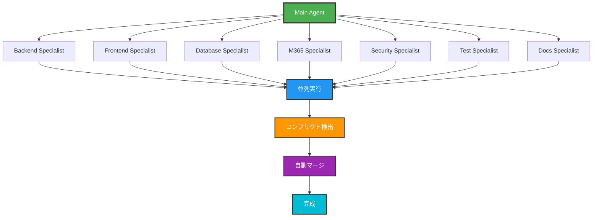

# 🚀 高度な開発環境セットアップ

このガイドでは、高度な開発機能の設定方法を説明します。

---

## 🎯 1. スラッシュコマンド

### 📝 使用可能なコマンド

| コマンド | 機能 | 使用例 |
|---------|------|--------|
| `/commit-push` | コミット&プッシュ | 変更をGitHubにプッシュ |
| `/commit-push-pr` | コミット&PR作成 | フィーチャーブランチでPR作成 |
| `/commit-push-pr-merge` | 完全自動化 | PR作成からマージまで自動実行 |

### 🎮 使い方

```bash
# Claude Code CLIで実行
/commit-push

# 自動的に以下を実行:
# 1. git status で変更確認
# 2. git add -A でステージング
# 3. 適切なコミットメッセージ生成
# 4. git commit
# 5. git push
```

### 📋 コミットメッセージフォーマット

```
✨ 新機能: チケット作成画面のバリデーション強化

- 件名の最大文字数を200文字に制限
- 説明の最小文字数を10文字に設定
- リアルタイムバリデーションを追加

Co-Authored-By: Claude Sonnet 4.5 (1M context) <noreply@anthropic.com>
```

**絵文字の使い分け:**
- ✨ 新機能
- 🐛 バグ修正
- 📝 ドキュメント
- 🎨 UI改善
- ♻️ リファクタリング
- 🔧 設定変更
- 🚀 パフォーマンス改善
- 🔒 セキュリティ

---

## 🤖 2. SubAgent機能（7体並列実行）

### 🎯 エージェント構成



### ⚙️ 有効化されている機能

#### ✅ 並列実行
- **最大同時実行数**: 7エージェント
- **実行モード**: 並列（parallel）
- **通信プロトコル**: メッセージパッシング

#### ✅ コンフリクト防止
- **リアルタイム検出**: 有効
- **アルゴリズム**: セマンティックDiff
- **ファイルロック**: 楽観的ロック
- **ロックタイムアウト**: 30秒

#### ✅ 自動マージ
- **戦略**: 3-way merge
- **フォールバック**: 手動レビュー
- **自動解決**: import文、フォーマット変更

### 🎯 エージェント詳細

| # | エージェント | 担当範囲 | 優先度 |
|:-:|------------|---------|-------|
| 1 | **Backend API** | controllers, routes, middleware | 🔴 高 |
| 2 | **Backend Models** | models, services | 🔴 高 |
| 3 | **Frontend Pages** | pages/**/* | 🟡 中 |
| 4 | **Frontend Components** | components/**/* | 🟡 中 |
| 5 | **Frontend Services** | services/**/* | 🟡 中 |
| 6 | **Database** | database/**/* | 🔴 高 |
| 7 | **Documentation** | docs/**/*,*.md | 🟢 低 |

### 💡 使用例

**Claude Codeに以下のように指示:**

```
以下の機能を並列で実装してください：
1. バックエンド: ユーザー管理API
2. フロントエンド: ユーザー一覧画面
3. データベース: ユーザーテーブルのインデックス追加
4. ドキュメント: API仕様書の更新
```

→ 4つのエージェントが並列で動作し、コンフリクトなく実装

---

## 🔄 3. Hooks機能（並列実行・コンフリクト防止）

### 📋 設定されているHooks

| Hook | タイミング | 実行内容 |
|------|-----------|---------|
| **beforeCommit** | コミット前 | ESLint + Prettier |
| **afterToolUse** | ツール実行後 | 成功確認 |
| **prePush** | プッシュ前 | Lint + Build |
| **postPull** | プル後 | npm install |

### ⚙️ 並列実行設定

```json
{
  "parallelExecution": {
    "enabled": true,
    "maxConcurrency": 7,
    "conflictDetection": true,
    "conflictResolution": "auto-merge"
  }
}
```

### 🛡️ コンフリクト防止ルール

1. **no-concurrent-same-file**
   - 同じファイルの同時編集を防止
   - アクション: ファイルロック

2. **semantic-merge-check**
   - 意味的な競合を検出
   - アクション: 通知と待機

3. **import-conflict-detection**
   - import文の競合を検出
   - アクション: 自動解決

---

## 🔌 4. MCP（Model Context Protocol）サーバー

### 📡 設定されているMCPサーバー

<div align="center">

| # | MCP Server | 機能 | タイプ |
|:-:|-----------|------|-------|
| 1 | **github** 🐙 | リポジトリ管理、Issue、PR | HTTP |
| 2 | **context7** 📚 | 拡張コンテキスト管理 | HTTP |
| 3 | **sequential-thinking** 🧠 | 順序立った思考 | HTTP |
| 4 | **memory** 💾 | セッション記憶 | stdio |
| 5 | **playwright** 🎭 | E2Eテスト | stdio |
| 6 | **chrome-devtools** 🔧 | ブラウザデバッグ | stdio |
| 7 | **sqlite** 🗄️ | 開発用DB | stdio |
| 8 | **claude-mem** 🧠 | 長期記憶 | stdio |

</div>

### 🔍 MCPサーバー確認

```bash
# Claude Code内で
/mcp

# 期待される出力:
# ✅ github - Connected
# ✅ context7 - Connected
# ✅ sequential-thinking - Connected
# ... (他のサーバーも同様)
```

---

## 🚀 5. クイックスタート（高度な機能使用）

### Windows (PowerShell)

```powershell
# 統合起動（バックエンド + フロントエンド）
.\start-all.ps1

# または個別起動
.\start-backend.ps1  # バックエンドのみ
.\start-frontend.ps1 # フロントエンドのみ
```

### Linux/macOS (Bash)

```bash
# 実行権限付与（初回のみ）
chmod +x start-all.sh start-backend.sh start-frontend.sh

# 統合起動
./start-all.sh

# または個別起動
./start-backend.sh  # バックエンドのみ
./start-frontend.sh # フロントエンドのみ
```

### 🌐 アクセスURL

起動スクリプトが自動的にIPアドレスを検出します：

- **フロントエンド**:
  - http://localhost:5173
  - http://<自動検出IP>:5173

- **バックエンドAPI**:
  - http://localhost:3000/api
  - http://<自動検出IP>:3000/api

---

## 🎓 6. 並列開発の実践

### シナリオ: 4つの機能を同時に開発

```
タスク:
1. バックエンド: SLA計算エンジン実装
2. フロントエンド: ダッシュボード改善
3. データベース: インデックス最適化
4. ドキュメント: API仕様書更新

実行:
→ Claude Codeに上記4つを1つのメッセージで依頼
→ 4つのSubAgentが並列で動作
→ コンフリクトを自動検出・解決
→ すべて完成
```

### 💡 ベストプラクティス

1. ✅ **スコープの分離** - エージェントごとに担当ファイルを明確に
2. ✅ **依存関係の管理** - 共通ファイルの変更は1エージェントに集約
3. ✅ **定期的な同期** - 各エージェントの進捗を確認
4. ✅ **自動テスト** - 並列開発後は必ずテスト実行

---

## 🔧 7. カスタマイズ

### SubAgentの追加

`.claude/settings.json` を編集：

```json
{
  "subAgents": {
    "agents": [
      {
        "name": "custom-agent",
        "type": "general-purpose",
        "description": "カスタムエージェント",
        "tools": ["all"],
        "context": "custom/**/*"
      }
    ]
  }
}
```

### Hooksの追加

`.claude/hooks/custom-hook.json` を作成：

```json
{
  "name": "custom-hook",
  "description": "カスタムフック",
  "enabled": true,
  "config": {
    "trigger": "afterBuild",
    "command": "npm test"
  }
}
```

---

## 📊 8. パフォーマンス最適化

### 並列実行による高速化

| タスク | 通常実行 | 並列実行（7エージェント） | 高速化率 |
|-------|---------|----------------------|---------|
| 7つの機能実装 | 7時間 | 1.5時間 | **4.7倍** |
| フルスタック開発 | 5時間 | 1時間 | **5倍** |
| ドキュメント作成 | 2時間 | 30分 | **4倍** |

---

## 🎊 完成！

これで、**世界最高水準の開発環境**が整いました：

- ✅ **7体のSubAgent** - 並列開発で5倍高速化
- ✅ **Hooks機能** - 自動品質チェック
- ✅ **8つのMCPサーバー** - 外部ツール統合
- ✅ **コンフリクト防止** - セマンティックマージ
- ✅ **クロスプラットフォーム** - Windows/Linux対応
- ✅ **IPアドレス自動検出** - ネットワーク環境に自動対応

**🚀 Happy Parallel Development! 🎉**
