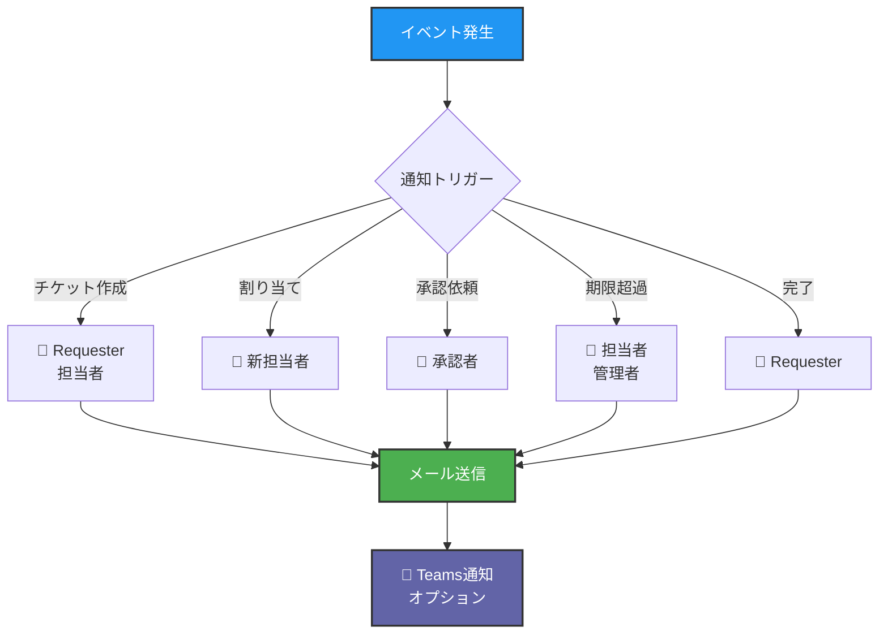

# 🗺️ 開発ロードマップ

Mirai ヘルプデスク管理システムの開発ロードマップです。

---

## 📊 現在の状況

<div align="center">

### ✅ Phase 1: MVP - **100% 完成**


</div>

---

## 🎯 次の開発ステップ

### 🔥 優先度: 最高（今すぐ実装推奨）

#### 1. 📊 SLA自動計算エンジン ⭐⭐⭐


**実装内容:**
- [ ] `backend/src/services/sla.service.ts`
- [ ] `backend/src/utils/businessHours.ts`
- [ ] 営業時間定義（9:00-18:00、土日祝除外）
- [ ] チケット作成時の自動期限設定
- [ ] 期限超過アラート機能

**完了条件:**
- ✅ P1チケット: 初動15分、解決2時間
- ✅ 営業時間外を除外した期限計算
- ✅ ダッシュボードに期限超過アラート表示

**所要時間:** 2-3時間

---

#### 2. 📧 通知システム ⭐⭐⭐



**実装内容:**
- [ ] `backend/src/services/notification.service.ts`
- [ ] `backend/src/services/email.service.ts`
- [ ] `backend/src/templates/email/` - HTMLメールテンプレート
- [ ] `backend/src/services/teams.service.ts` (オプション)
- [ ] `backend/src/jobs/notification.job.ts` - 定期チェック

**通知種別:**
1. **チケット作成** → Requester + 初期担当者
2. **チケット割り当て** → 新担当者
3. **承認依頼** → 承認者
4. **承認/却下** → 依頼者
5. **期限超過** → 担当者 + 管理者
6. **完了** → Requester
7. **コメント追加** → 関係者

**完了条件:**
- ✅ SMTPサーバー経由でメール送信
- ✅ HTMLメールテンプレート
- ✅ 通知履歴の記録
- ✅ 通知設定（ユーザーごとに有効/無効）

**所要時間:** 3-4時間

---

#### 3. ✅ 承認ワークフロー完全実装 ⭐⭐

**実装内容:**
- [ ] `backend/src/models/approval.model.ts`
- [ ] `backend/src/controllers/approval.controller.ts`
- [ ] `backend/src/services/approval.service.ts`
- [ ] 承認依頼作成API
- [ ] 承認/却下処理
- [ ] SODチェック強化
- [ ] M365タスクとの連携

**ワークフロー:**
```
チケット作成 → 承認依頼 → 承認者レビュー → 承認/却下
                                       ↓
                               M365タスク実施可能状態
                                       ↓
                               Operator実施 → 実施ログ記録
```

**完了条件:**
- ✅ 承認依頼API実装
- ✅ SOD違反をDBレベルでチェック
- ✅ 承認後のM365タスク状態更新
- ✅ 承認履歴の完全記録

**所要時間:** 3-4時間

---

#### 4. 📎 ファイルアップロード機能 ⭐⭐

**実装内容:**
- [ ] `backend/src/middleware/upload.ts` - multer設定
- [ ] `backend/src/controllers/attachment.controller.ts`
- [ ] `backend/src/routes/attachment.routes.ts`
- [ ] ファイルサイズ・タイプバリデーション
- [ ] SHA-256ハッシュ計算
- [ ] ストレージ管理（filesystem or Azure Blob）

**セキュリティ:**
- ファイルサイズ制限: 10MB
- 許可拡張子: `.jpg, .png, .pdf, .docx, .xlsx, .txt, .log, .zip`
- ウイルススキャン（オプション）

**完了条件:**
- ✅ チケットに添付ファイルをアップロード
- ✅ M365実施ログにエビデンス添付
- ✅ ファイルダウンロードAPI

**所要時間:** 2-3時間

---

### 🟡 優先度: 高（Week 2）

#### 5. 🗄️ M365タスク・実施ログの完全実装

**実装内容:**
- [ ] `backend/src/models/m365-task.model.ts`
- [ ] `backend/src/models/m365-execution-log.model.ts`
- [ ] タスク状態管理（pending → approved → in_progress → completed）
- [ ] 実施ログ記録（エビデンス必須）
- [ ] SODチェック（承認者≠実施者）

**所要時間:** 4-5時間

---

#### 6. 📚 ナレッジベース完全実装

**実装内容:**
- [ ] `backend/src/models/knowledge.model.ts`
- [ ] `backend/src/controllers/knowledge.controller.ts`
- [ ] 全文検索（PostgreSQL tsvector）
- [ ] タグフィルタリング
- [ ] チケット→ナレッジ化機能
- [ ] 役立った/立たなかった投票

**所要時間:** 3-4時間

---

#### 7. ⏰ 自動クローズ機能

**実装内容:**
- [ ] `backend/src/jobs/auto-close.job.ts`
- [ ] node-cron または Bull キュー
- [ ] Resolved状態から3日後に自動Closed
- [ ] 事前通知メール（1日前）

**所要時間:** 2時間

---

### 🟢 優先度: 中（Week 3-4）

#### 8. 📊 KPIダッシュボード充実

**実装内容:**
- [ ] SLA達成率グラフ
- [ ] カテゴリ別統計
- [ ] 担当者別パフォーマンス
- [ ] Chart.js または Recharts
- [ ] CSVエクスポート

**所要時間:** 4-5時間

---

#### 9. 📄 レポート生成機能

**実装内容:**
- [ ] 月次レポート自動生成
- [ ] PDF出力（puppeteer）
- [ ] メール自動送信
- [ ] カスタムレポート作成

**所要時間:** 3-4時間

---

#### 10. 🧪 E2Eテスト

**実装内容:**
- [ ] Playwright テストスイート
- [ ] ログイン→チケット作成→承認→完了のフルフロー
- [ ] CI/CDパイプライン統合
- [ ] テストレポート生成

**所要時間:** 5-6時間

---

## 🏆 Phase 2: Microsoft 365 連携強化

#### 11. 🔄 ユーザー/ライセンス自動同期

**実装内容:**
- [ ] 定期的なGraph API同期（日次）
- [ ] ライセンス情報のキャッシュ
- [ ] 差分更新
- [ ] 同期履歴の記録

**所要時間:** 4-5時間

---

#### 12. 📧 Exchange Online 詳細操作

**実装内容:**
- [ ] メールボックス権限管理
- [ ] 送信代理・フルアクセス権限
- [ ] メールフロールール
- [ ] 配布リスト管理

**所要時間:** 5-6時間

---

#### 13. 📁 SharePoint 管理機能

**実装内容:**
- [ ] サイト作成
- [ ] 権限管理
- [ ] ドキュメントライブラリ操作

**所要時間:** 4-5時間

---

## 🚀 Phase 3: 自動化

#### 14. ⚙️ 承認済み標準作業の自動実行

**実装内容:**
- [ ] 承認後の自動Graph API呼び出し
- [ ] Bull/BullMQ ジョブキュー
- [ ] リトライ機能
- [ ] エラーハンドリング

**所要時間:** 6-8時間

---

#### 15. 🔄 定期実行ジョブ

**実装内容:**
- [ ] SLA期限チェック（毎時）
- [ ] 自動クローズ（毎日）
- [ ] レポート生成（月次）
- [ ] ライセンス同期（毎日）

**所要時間:** 3-4時間

---

## 📅 推奨実装スケジュール

### Week 1: コア機能の完成 🔥

| Day | タスク | 所要時間 | 完了 |
|:---:|:------|:-------:|:----:|
| 1-2 | SLA自動計算 | 2-3h | ⬜ |
| 3-4 | 通知システム | 3-4h | ⬜ |
| 5 | 承認ワークフロー | 3-4h | ⬜ |

### Week 2: 機能拡張 🟡

| Day | タスク | 所要時間 | 完了 |
|:---:|:------|:-------:|:----:|
| 1-2 | ファイルアップロード | 2-3h | ⬜ |
| 3-4 | M365タスク完全実装 | 4-5h | ⬜ |
| 5 | ナレッジベース完全実装 | 3-4h | ⬜ |

### Week 3: 運用機能 🟢

| Day | タスク | 所要時間 | 完了 |
|:---:|:------|:-------:|:----:|
| 1 | 自動クローズ | 2h | ⬜ |
| 2-3 | KPIダッシュボード | 4-5h | ⬜ |
| 4-5 | レポート生成 | 3-4h | ⬜ |

### Week 4: 品質向上 ✨

| Day | タスク | 所要時間 | 完了 |
|:---:|:------|:-------:|:----:|
| 1-3 | E2Eテスト | 5-6h | ⬜ |
| 4-5 | CI/CDパイプライン | 3-4h | ⬜ |

---

## 🎊 完成後の姿

すべての機能が実装されると：

- ✅ **完全自動化** - 承認後にM365操作を自動実行
- ✅ **24/7監視** - GitHub Actionsで継続的監視
- ✅ **自己修復** - エラーを自動検知・修復
- ✅ **統計・レポート** - KPIダッシュボード・月次レポート
- ✅ **高品質** - E2Eテスト・CI/CDパイプライン

**世界最高水準のヘルプデスクシステムの完成！🌟**

---

## 📞 次のアクション

**今すぐできること:**

1. **SLA自動計算** の実装開始
2. **通知システム** の実装開始
3. **承認ワークフロー** の実装開始
4. **ファイルアップロード** の実装開始

**どれから始めますか？**

Claude Codeがフルサポートで実装をお手伝いします！🚀
