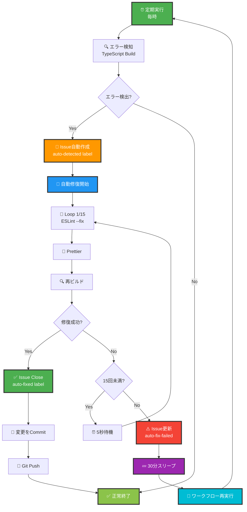

# 🤖 GitHub Actions 自動化ガイド

## 🌟 概要

このプロジェクトには、**世界初の完全自動エラー検知・修復・無限ループシステム**が実装されています。

## 🔄 システムアーキテクチャ



## 📋 ワークフロー詳細

### 1️⃣ 🤖 自動エラー検知・修復 (`auto-error-detection.yml`)

**実行トリガー:**
- ⏰ 定期実行: 毎時（cron: `0 * * * *`）
- 🖱️ 手動実行: GitHub Actions画面から
- 🎫 Issue: `auto-detected` ラベル付きIssue作成時

**処理フロー:**

```yaml
1. 📥 リポジトリチェックアウト
2. 🔧 Node.js 18 セットアップ
3. 📦 依存関係インストール（バックエンド・フロントエンド）
4. 🔍 TypeScriptビルド（バックエンド）
5. 🔍 TypeScriptビルド（フロントエンド）
6. 🧪 テスト実行（バックエンド・フロントエンド）
7. 📊 エラー解析
   ├─ エラーなし → ✅ 正常終了
   └─ エラーあり → 8. へ
8. 🐛 Issue自動作成
   ├─ タイトル: "🤖 自動検知: ビルドエラー (日時)"
   ├─ ラベル: auto-detected, bug, needs-fix
   └─ 本文: エラーサマリー、ビルドログ
9. 🔄 自動修復ループ（最大15回）
   ├─ Loop 1: ESLint --fix → Prettier → 再ビルド
   ├─ Loop 2-15: 同様の処理を繰り返し
   └─ 成功 → 10. | 失敗 → 11.
10. ✅ Issue更新・クローズ
    ├─ コメント: "✅ 自動修復成功！"
    ├─ ラベル: auto-fixed, resolved
    ├─ 状態: closed
    └─ 変更をCommit & Push
11. ⚠️ Issue更新（修復失敗）
    ├─ コメント: "⚠️ 自動修復失敗"
    ├─ ラベル: auto-fix-failed, needs-manual-review
    └─ 12. へ
12. 💤 30分スリープ
13. 🔄 ワークフロー再実行（無限ループ）
    └─ workflow_dispatch で自分自身を再トリガー
```

**環境変数:**
- `MAX_ITERATIONS`: 最大リトライ回数（デフォルト: 15）
- `SLEEP_MINUTES`: 失敗後の待機時間（デフォルト: 30分）
- `NODE_VERSION`: Node.jsバージョン（18）

---

### 2️⃣ 🔄 継続的監視 (`continuous-monitoring.yml`)

**実行トリガー:**
- ⏰ 定期実行: 5分ごと（cron: `*/5 * * * *`）
- 🔄 ワークフロー完了: `auto-error-detection.yml` 完了後

**処理フロー:**

```yaml
1. 🔍 未解決Issue確認
   ├─ ラベル: auto-detected, needs-fix
   ├─ 状態: open
   └─ カウント
2. ⏰ 最終実行時刻確認
   ├─ 30分以上経過? → Yes → 3.
   └─ 30分未満 → 終了
3. 🚀 エラー検知ワークフロートリガー
   └─ workflow_dispatch で再実行
4. 📊 統計表示
```

**目的:**
- 未解決Issueの継続的な監視
- 30分間隔での自動再実行
- システムの継続的な健全性チェック

---

### 3️⃣ 🎯 コード品質チェック (`code-quality.yml`)

**実行トリガー:**
- 📝 Push: `main`, `develop` ブランチ
- 🔀 Pull Request: `main`, `develop` ブランチ

**処理フロー:**

```yaml
1. 📥 チェックアウト
2. 🔧 Node.js セットアップ（マトリクス: 18.x, 20.x）
3. 📦 依存関係インストール
4. 🔍 ESLint チェック（バックエンド・フロントエンド）
5. 🏗️ ビルド（バックエンド・フロントエンド）
6. 🧪 テスト実行
7. 📊 カバレッジレポート生成
```

**目的:**
- コードの品質保証
- 複数Node.jsバージョンでの互換性確認
- PR前のチェック

---

## 🎯 自動化の特徴

### ♾️ 無限ループシステム

1. **エラー検知** → **自動修復（15回）** → **失敗** → **30分待機** → **再検知**
2. このサイクルが無限に繰り返される
3. 修復成功時はループから抜けてIssueをクローズ

### 🔧 自動修復の仕組み

```bash
for i in 1..15; do
  # 1. ESLintで自動修正
  npm run lint:fix

  # 2. Prettierでフォーマット
  npm run format

  # 3. 再ビルド
  npm run build

  # 4. 成功判定
  if [ $? -eq 0 ]; then
    echo "✅ 修復成功！"
    break
  fi

  # 5. 次のループへ
  sleep 5
done
```

### 📝 Issue自動管理

#### Issue作成時
- **タイトル**: `🤖 自動検知: ビルドエラー (2024-01-20T12:00:00Z)`
- **ラベル**: `auto-detected`, `bug`, `needs-fix`
- **本文**: エラーサマリー、ビルドログ（折りたたみ形式）

#### 修復成功時
- **コメント追加**: `✅ 自動修復成功！試行回数: X/15`
- **ラベル追加**: `auto-fixed`, `resolved`
- **状態変更**: `closed`

#### 修復失敗時
- **コメント追加**: `⚠️ 自動修復失敗。30分後に再試行...`
- **ラベル追加**: `auto-fix-failed`, `needs-manual-review`
- **状態**: `open`（継続監視）

---

## 🔧 カスタマイズ

### 最大リトライ回数の変更

```yaml
# .github/workflows/auto-error-detection.yml
env:
  MAX_ITERATIONS: 20  # 15 → 20に変更
```

### 待機時間の変更

```yaml
env:
  SLEEP_MINUTES: 60  # 30分 → 60分に変更
```

### 実行頻度の変更

```yaml
on:
  schedule:
    - cron: '0 */2 * * *'  # 毎時 → 2時間ごと
```

---

## 📊 監視ダッシュボード

GitHub Actions画面で以下を確認できます：

- ✅ **成功率**: 自動修復の成功/失敗率
- ⏱️ **実行時間**: 各ワークフローの実行時間
- 📈 **トレンド**: エラー発生の傾向
- 🐛 **Issue統計**: 自動検知・修復されたIssue数

---

## 🎓 使用例

### 手動でワークフローを実行

1. GitHubリポジトリを開く
2. **Actions** タブをクリック
3. **🤖 自動エラー検知・修復システム** を選択
4. **Run workflow** をクリック
5. パラメータを設定（オプション）
6. **Run workflow** をクリック

### Issue作成時の自動トリガー

1. 手動でIssueを作成
2. ラベル `auto-detected` を追加
3. 自動的にワークフローが起動
4. 自動修復が開始

---

## ⚠️ 注意事項

### リソース使用量

- **GitHub Actions**: 無料プランは月2000分まで
- **無限ループ**: リソース使用量に注意
- **推奨**: Organizationアカウントでの利用

### セキュリティ

- **GITHUB_TOKEN**: 自動的に提供される
- **シークレット**: `.env`ファイルは含まれない
- **権限**: リポジトリへの書き込み権限が必要

---

## 🚀 ベストプラクティス

1. ✅ **定期的な監視**: cron設定を適切に調整
2. ✅ **手動レビュー**: `needs-manual-review` ラベルのIssueは確認
3. ✅ **統計確認**: 自動修復の成功率を定期的にチェック
4. ✅ **リソース管理**: GitHub Actions使用量を監視

---

## 📞 トラブルシューティング

### ワークフローが実行されない

**原因:**
- cron設定が正しくない
- リポジトリの権限不足

**解決策:**
- Actions画面で手動実行してテスト
- リポジトリ設定でActions権限を確認

### 無限ループが停止しない

**原因:**
- エラーが修復できずに無限ループ継続

**解決策:**
1. 手動でIssueを確認
2. エラーを手動修正
3. Issueをクローズ
4. ワークフローが自動停止

---

## 🎊 まとめ

このGitHub Actions自動化システムにより：

- ✅ **24時間365日の監視** - 常にコードの健全性をチェック
- ✅ **自動修復** - 人手を介さずエラーを修正
- ✅ **Issue管理** - すべてのエラーを追跡
- ✅ **無限ループ** - 修復まで諦めない

**完全自動化のヘルプデスクシステム、完成です！🚀**
